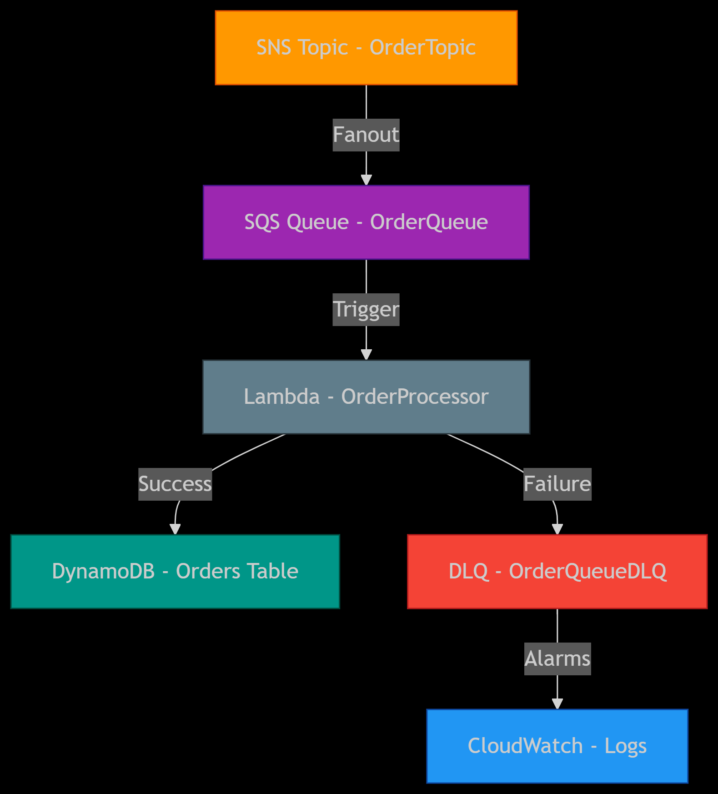
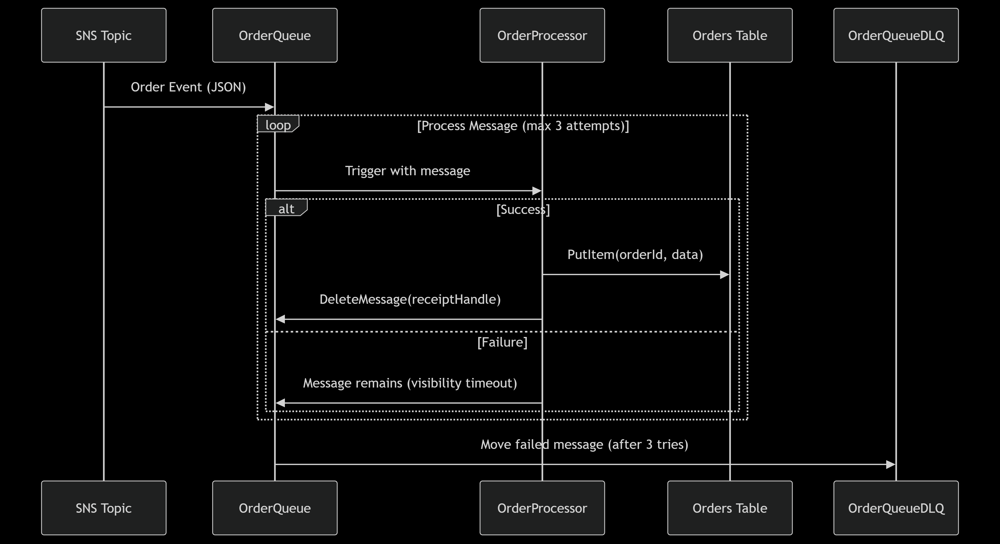
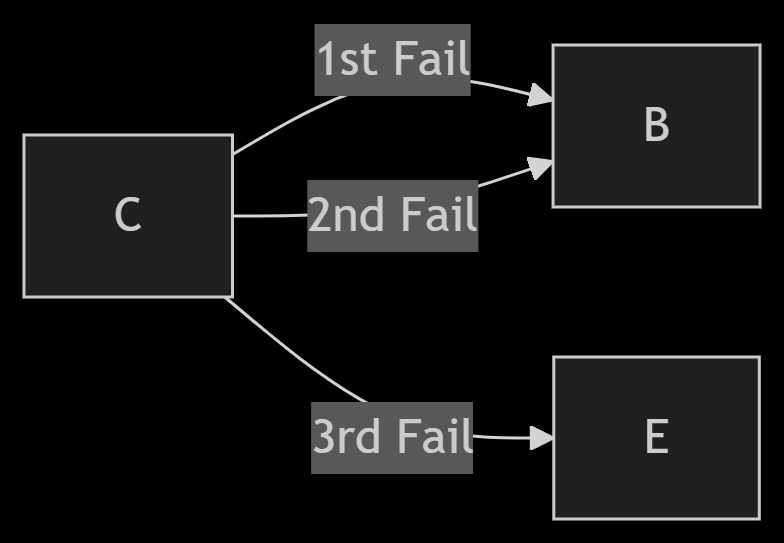

# Event-Driven Order Notification System


## Setup Instructions

### Prerequisites
- AWS account with admin permissions
- AWS CLI configured
- Python 3.9+

### Deployment Steps
1. Clone this repository:
   ```bash
   git clone https://github.com/sarahelfeel04/order-notification-system.git


2. Deploy the CloudFormation stack:

    ```bash
    aws cloudformation deploy \
    --template-file template.yaml \
    --stack-name OrderNotificationSystem \
    --capabilities CAPABILITY_IAM \
    --region us-east-1

3. Test the system:

    a) AWS Console:
    - go to your SNS topic
    - click public message
    - add a sample message
    - publish it

    Example message:
    ```json
    {
    "orderId": "TEST12345",
    "userId": "U789",
    "itemName": "Wireless Headphones",
    "quantity": 2,
    "status": "pending",
    "timestamp": "2025-05-06T14:30:00Z"
    }
    ```

   b) CLI:

    ```bash
    aws sns publish \
    --topic-arn $(aws cloudformation describe-stacks --stack-name OrderNotificationSystem --query "Stacks[0].Outputs[?OutputKey=='OrderTopicARN'].OutputValue" --output text) \
    --message '{"orderId":"O1234","userId":"U123","itemName":"Laptop","quantity":1,"status":"new","timestamp":"2025-05-03T12:00:00Z"}'
    ```

## Components
DynamoDB: Stores order data

SNS: Broadcasts notifications

SQS: Queues order events

Lambda: Processes orders

DLQ: Handles failed messages


## Architecture diagram

### 1. Architecture diagram



### 2. Sequence Diagram



### 3. Retry scenario



