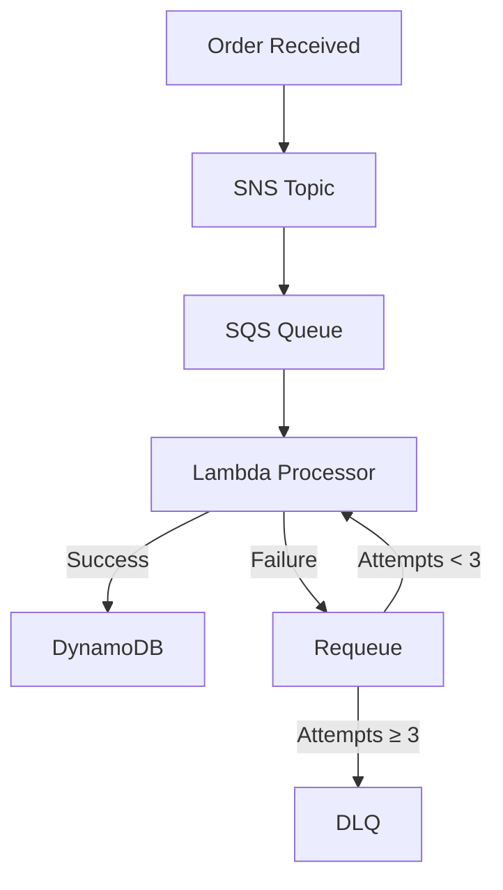

# Visibility Timeout and Dead Letter Queue Architecture

## Message Processing Lifecycle



## Key Mechanisms

### 1. Visibility Timeout (30 seconds)

**Purpose:**  
Prevents duplicate processing during temporary failures while allowing automatic retries.

**How It Works:**

- When Lambda retrieves a message, it becomes temporarily invisible.
- The processor must explicitly delete the message upon success.
- If processing fails (crash/timeout), the message reappears after the timeout expires.

**Configuration:**

```yaml
RedrivePolicy:
  maxReceiveCount: 3  # Attempts before DLQ
  VisibilityTimeout: 30  # Seconds
```

**Benefits:**

✅ Handles transient failures (cold starts, throttling)  
✅ Prevents duplicate order processing  
✅ Self-healing for temporary issues  

---

### 2. Dead Letter Queue (DLQ)

**Purpose:**  
Isolates messages that consistently fail processing after retries.

**Failure Handling:**

- First failure: Message requeued (invisible for 30s)
- Second failure: Requeued again
- Third failure: Automatically moved to DLQ

**Analysis Advantages:**

- Preserves failed messages for debugging  
- CloudWatch metrics track DLQ depth  
- Enables reprocessing after fixes  

---

### Operational Benefits

**For Developers:**

- Timeout values prevent infinite retry loops  
- DLQ messages show exact failure context (e.g., malformed JSON)  
- Logs reveal whether failures are transient or systemic  

**For Business:**

- Zero lost orders (all failures are accounted for)  
- Automated recovery for temporary issues  
- Metrics to calculate success/failure rates  